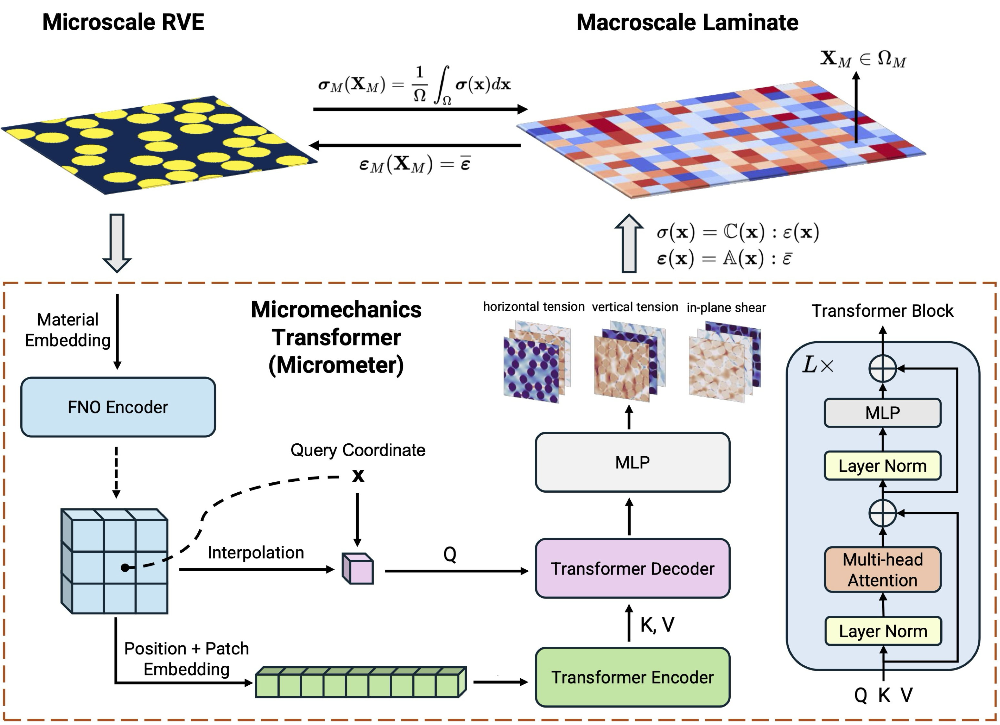

# Micrometer: Micromechanics Transformer  for Predicting the Mechanical Response of Heterogeneous Materials

Code for [paper](https://arxiv.org/abs/2410.05281v1) *Micrometer: Micromechanics Transformer for Predicting Mechanical Responses of Heterogeneous Materials.*




## Getting Started

### Installation

Our code has been tested with a Linux environment using the following configuration:

- Python 3.9
- CUDA 12.4
- CUDNN 8.9
- JAX 0.4.26


First, clone the repository:

```angular2html
git clone https://github.com/PredictiveIntelligenceLab/micrometer.git
cd micrometer
```

Then, install the required packages

```angular2html
pip3 install -U pip
pip3 install --upgrade jax jaxlib
pip3 install --upgrade -r requirements.txt
```

Finally, install the package:

```angular2html
pip3 install -e .
```


### Dataset

Our dataset can be downloaded from the following Google Drive links:

| Name                 | Link     |
|----------------------|----------|
| CMME                 | [Link](https://drive.google.com/drive/folders/1eeFrLQkJawuJAcizykwg3kQM1yCyaF74?usp=sharing) |
| Homogenization       | [Link](https://drive.google.com/drive/folders/1nN0LoqwkGVe_k74XIZZNLHvBgADPoC7F?usp=sharing) |
| Multiscale Modelling | [Link](https://drive.google.com/drive/folders/1PBTqFkVn63IfEgz4J3RbvxoUj6ZT5AHe?usp=sharing) |
| Transfer Learning    | [Link](https://drive.google.com/drive/folders/1PIggy_sadd3iX1JSAkIxe5vdbIABszFy?usp=sharing) |


### Training

First, please place the downloaded the dataset and change the data path in
the corresponding config file, e.g. in `configs/base.py`:

```angular2html
dataset.data_path = "path/to/dataset"
```

Then, to train our Micrometer (e.g. `cvit_b_16`), run the following command:

```angular2html
python3 main.py --config=configs/base.py:cvit_b_16
```

The user can also train other models by changing the model name 
in the above command, e.g. `cvit_b_16` to `cvit_l_8`. We also provide UNet or FNO of different configurations as the backbone model,
which can be found in `configs/models.py`.


To specify the GPU device, for example, use the following command:

```angular2html
CUDA_VISIBLE_DEVICES=0,1,2,3 python3 main.py --config=configs/base.py:cvit_b_16
```

### Evaluation

To evaluate the trained model (e.g. `cvit_b_16`), run the following command:

```angular2html
python3 main.py --config=configs/base.py:cvit_b_16 --config.mode=eval
```

### Homogenization

With the pre-trained model, we can perform homogenization by running the following command:

```angular2html
python3 main.py --config=configs/homo.py:cvit_b_16
```

### Mutli-scale Modeling


With the pre-trained model, we can perform multiscale modelling

```angular2html
python3 main.py --config=configs/multiscale.py:cvit_b_16
```


### Transfer Learning

We can also fine-tune our pretrained model on new datasets, which is configured in
`finetune_vf.py ` or `finetune_ch.py`

```angular2html
python3 main.py --config=configs/finetune_ch.py:cvit_b_16 
```


## Checkpoints


We provide pre-trained model checkpoints for the best configurations. These checkpoints can be used to initialize the model for further training or evaluation.


| Model Configuration | Checkpoint |
|----------------------|--------------|
| Micrometer-L-8       | [Link](https://drive.google.com/file/d/1BwcGan0OMqYRGgqZ3_PPc2NJ9CSeY5dw/view?usp=drive_link)     |
| Micrometer-L-16      | [Link](https://drive.google.com/file/d/1vcmCbItXgAXF8OM_UZCIiEMbqZX6oxAX/view?usp=drive_link)     |


## Citation

Our work is motivated by our previous research on *bridging operator learning and conditioned neural fields*. If you find this work useful, please consider citing the following papers: 

    @article{wang2024bridging,
      title={Bridging Operator Learning and Conditioned Neural Fields: A Unifying Perspective},
      author={Wang, Sifan and Seidman, Jacob H and Sankaran, Shyam and Wang, Hanwen and Pappas, George J and Perdikaris, Paris},
      journal={arXiv preprint arXiv:2405.13998},
      year={2024}
    }

    @article{wang2024micrometer,
      title={Micrometer: Micromechanics Transformer for Predicting Mechanical Responses of Heterogeneous Materials},
      author={Wang, Sifan and Liu, Tong-Rui and Sankaran, Shyam and Perdikaris, Paris},
      journal={arXiv preprint arXiv:2410.05281},
      year={2024}
    }


